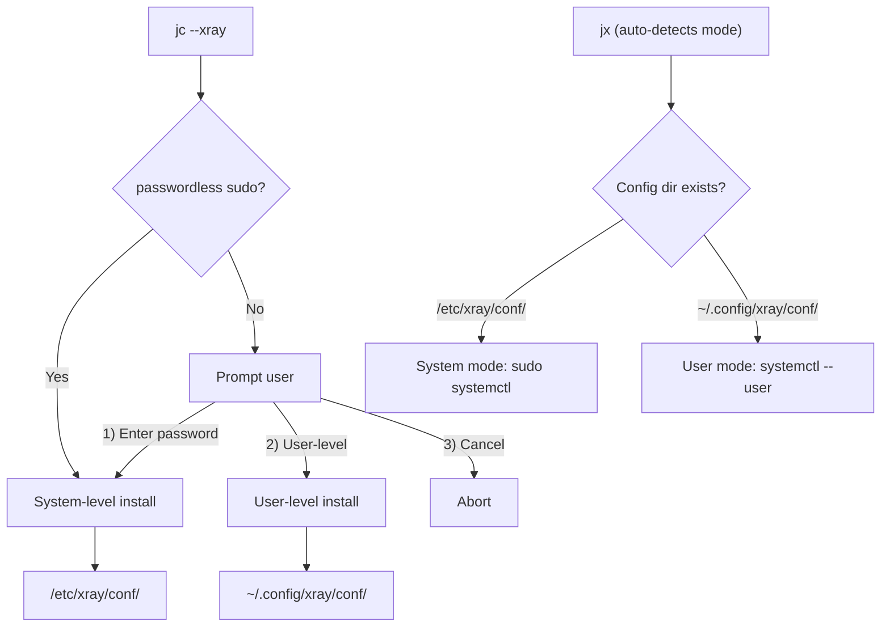

# Full Xray VLESS-REALITY Server in jc

## Architecture

The xray management supports **dual-mode**: system-level (default) or user-level. The install script auto-detects sudo access and prompts the user if needed. The manager script (`jx`) auto-detects which mode is active.



## Dual-mode path mapping

- System-level (default, requires sudo)
  - Binary: `/etc/xray/bin/xray` (symlink)
  - Configs: `/etc/xray/conf/`
  - Geodata: `/etc/xray/bin/`
  - Service: `/etc/systemd/system/xray.service`
  - Commands: `sudo systemctl start/stop/restart xray`
  - Logs: `journalctl -u xray`

- User-level (no sudo needed)
  - Binary: `~/.usr/bin/xray`
  - Configs: `~/.config/xray/conf/`
  - Geodata: `~/.usr/share/xray/`
  - Service: `~/.config/systemd/user/xray.service`
  - Commands: `systemctl --user start/stop/restart xray`
  - Logs: `journalctl --user -u xray`
  - Note: `loginctl enable-linger $USER` recommended for persistence after logout

## File structure

- [jc](jc) -- `--xray` install/update/remove, with sudo detection and dual-mode support
- `nv-tools/xray-manager` -- management script (aliased as `jx`), auto-detects mode
- `assets/xray/xray.service` -- system-level systemd unit file
- `assets/xray/xray-user.service` -- user-level systemd unit file (uses `%h` for $HOME)
- `assets/xray/xray-plan.md` -- this plan document

## Changes to [jc](jc)

### 1. Update `installXray()` (existing)

Add sudo detection and dual-mode install after downloading the binary:

```bash
if sudo -n true 2>/dev/null; then
    # passwordless sudo available -> system-level
    setup_system_level
else
    # prompt user
    echo "System-level install requires sudo. Choose:"
    echo "  1) Enter sudo password (system-level)"
    echo "  2) Install user-level (no sudo needed)"
    echo "  3) Cancel"
    # ... read choice and dispatch
fi
```

- System-level: create `/etc/xray/{bin,conf}/`, symlink binary, copy geodata, install systemd service
- User-level: create `~/.config/xray/conf/`, install user systemd service to `~/.config/systemd/user/`

### 2. Update `removeXray()` (existing)

Auto-detect mode and clean the right paths:
- System-level: stop service, remove `/etc/xray/`, `/var/log/xray/`, system service file
- User-level: stop user service, remove `~/.config/xray/`, user service file

## Update: `nv-tools/xray-manager`

Add `detect_mode()` at the top that sets all path variables based on which config directory exists:

```bash
detect_mode() {
    if [[ -d /etc/xray/conf ]]; then
        XRAY_MODE="system"
        XRAY_CONF_DIR=/etc/xray/conf
        XRAY_BIN=/etc/xray/bin/xray
        SYSTEMCTL_CMD="sudo systemctl"
        JOURNALCTL_CMD="journalctl -u xray"
    else
        XRAY_MODE="user"
        XRAY_CONF_DIR="$HOME/.config/xray/conf"
        XRAY_BIN="$HOME/.usr/bin/xray"
        SYSTEMCTL_CMD="systemctl --user"
        JOURNALCTL_CMD="journalctl --user -u xray"
    fi
}
```

All commands use `$XRAY_CONF_DIR`, `$XRAY_BIN`, `$SYSTEMCTL_CMD` instead of hardcoded paths. The `require_root` check only applies in system mode.

### Commands (unchanged)

- `jx add [port] [uuid] [sni]` -- Add a VLESS-REALITY config
- `jx change [name]` -- Change config settings
- `jx info [name]` -- Show config details
- `jx del [name]` -- Delete a config
- `jx qr [name]` -- Show QR code (requires `qrencode`)
- `jx url [name]` -- Show share URL
- `jx start/stop/restart/status` -- Manage systemd service
- `jx log` -- Show xray logs
- `jx help` -- Show help

### `add reality` flow (core logic)

1. Generate UUID: `xray uuid`
2. Generate x25519 keypair: `xray x25519`
3. Pick or use provided port (default: 443)
4. Pick or use provided SNI (default: `www.nvidia.com`)
5. Generate shortId (random 8-char hex)
6. Write config JSON to `$XRAY_CONF_DIR/VLESS-REALITY-<port>.json`
7. Restart xray service via `$SYSTEMCTL_CMD`
8. Print config info + share URL

### Share URL format

```
vless://<UUID>@<IP>:<PORT>?encryption=none&flow=xtls-rprx-vision&type=tcp&security=reality&sni=<SNI>&fp=chrome&pbk=<PUBLIC_KEY>&sid=<SHORT_ID>#<NAME>
```

### Systemd service files

System-level (`assets/xray/xray.service`):

```ini
[Unit]
Description=Xray Service
After=network.target nss-lookup.target

[Service]
ExecStart=/etc/xray/bin/xray run -confdir /etc/xray/conf
Restart=on-failure
RestartSec=3
LimitNOFILE=65535

[Install]
WantedBy=multi-user.target
```

User-level (`assets/xray/xray-user.service`):

```ini
[Unit]
Description=Xray Service
After=network.target

[Service]
ExecStart=%h/.usr/bin/xray run -confdir %h/.config/xray/conf
Restart=on-failure
RestartSec=3
Environment=XRAY_LOCATION_ASSET=%h/.usr/share/xray

[Install]
WantedBy=default.target
```

### SNI candidates list

```
www.nvidia.com, developer.nvidia.com, www.amazon.com, www.cloudflare.com,
dash.cloudflare.com, aws.amazon.com
```

## Other files (already created, need update)

- `track-files/bashrc` -- `alias jx='xray-manager'` (done)
- `completion/jx_completion.bash` -- tab completion for `jx` (done)
