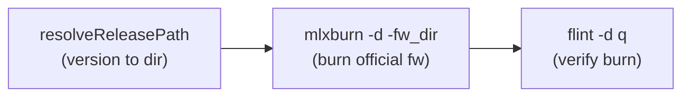

# Burn Official Image Feature for jmake

## Context

The existing `--burn` flow in [jmake](crosslv/nv-tools/jmake) (lines 1335-1455) burns **locally-built** `.mlx` firmware through a 6-step process (PSID lookup, INI match, `mlxburn image`, `flint burn`). For official release images, the process is much simpler -- just `mlxburn -d <device> -fw_dir <release_path> -y` -- as described in [compare_fw_perf_plan.md](/auto/fwgwork1/pexiang/bugZilla/bug_4950555_degardation_on_argaman/compare_fw_perf_plan.md).

The external `func_fwc` tool (defined in `/mswg/projects/fw/fw_ver/hca_fw_tools/find_fw_version_info.sh`, calls `find_fw_version_info.py`) resolves FW versions to release paths. Its core logic is a simple lookup table + path formula. We will **migrate this logic directly into jmake** so there is no external dependency.

## New CLI Interface

Add one new option:

- `--burn-official <version>` -- Burns an official release image. Takes a FW version string (e.g., `82.49.0052`). The release directory is computed internally using a major-version-to-device-ID mapping (migrated from `func_fwc`).
- Requires `--device` (already exists)
- Combine with existing `--fwreset` to reset hardware after burning. If `--fwreset` is omitted, only the burn is performed.

Usage examples:
```bash
# Burn official image only (no reset)
jmake --burn-official 82.49.0052 --device /dev/mst/mt4133_pciconf0

# Burn official image + reset hardware
jmake --burn-official 82.49.0052 --fwreset --device /dev/mst/mt4133_pciconf0
```

## Implementation Details

### 1. Add version-to-device-ID mapping and path resolver

The release path formula (from [find_fw_version_info.py](/mswg/projects/fw/fw_ver/hca_fw_tools/find_fw_version_info.py) lines 57-101) is:

```
/mswg/release/host_fw/fw-{DEVID}/fw-{DEVID}-rel-{XX}_{YY}_{ZZZZ}/
```

Where `XX` is the major version, mapped to `DEVID` via a lookup table. Add near the existing `MODEL_HARDWARE` and `MODEL_MLX_FILE` maps (around line 72-93):

```bash
# Major FW version to device ID mapping (from find_fw_version_info.py)
# Used by --burn-official to resolve release directory paths
declare -A FW_MAJOR_TO_DEVID=(
    [22]="4125"    # arava  (CX6DX)
    [24]="41686"   # viper  (BF2)
    [26]="4127"    # tamar  (CX6LX)
    [28]="4129"    # carmel (CX7)
    [32]="41692"   # mustang (BF3)
    [40]="4131"    # gilboa (CX8)
    [82]="4133"    # argaman (CX9)
)
RELEASE_BASE="/mswg/release/host_fw"
```

Add a helper function `resolveReleasePath()`:

```bash
# Resolve a FW version string (XX.YY.ZZZZ) to its official release directory
# Sets global: fResolvedFwDir
resolveReleasePath() {
    local version="$1"
    local major minor patch

    # Parse XX.YY.ZZZZ or XX_YY_ZZZZ
    if [[ "$version" == *.* ]]; then
        IFS='.' read -r major minor patch <<< "$version"
    elif [[ "$version" == *_* ]]; then
        IFS='_' read -r major minor patch <<< "$version"
    else
        echo -e "$NOTATION ${RED}Error: Invalid version format: ${YELLOW}$version${RESET}"
        echo -e "$NOTATION Expected format: XX.YY.ZZZZ (e.g., 82.49.0052)"
        exit 1
    fi

    local devId="${FW_MAJOR_TO_DEVID[$major]}"
    if [[ -z "$devId" ]]; then
        echo -e "$NOTATION ${RED}Error: Unknown major version ${YELLOW}$major${RESET}"
        echo -e "$NOTATION Supported: ${CYAN}${!FW_MAJOR_TO_DEVID[*]}${RESET}"
        exit 1
    fi

    # Zero-pad patch to 4 digits
    patch=$(printf "%04d" "$((10#$patch))")
    fResolvedFwDir="${RELEASE_BASE}/fw-${devId}/fw-${devId}-rel-${major}_${minor}_${patch}"

    if [[ ! -d "$fResolvedFwDir" ]]; then
        echo -e "$NOTATION ${RED}Error: Release directory not found: ${YELLOW}$fResolvedFwDir${RESET}"
        exit 1
    fi
}
```

Example: `82.49.0052` -> `DEVID=4133` -> `/mswg/release/host_fw/fw-4133/fw-4133-rel-82_49_0052`

### 2. New global variable and option parsing

Add to the global variables section (around line 35-43):

```bash
fBurnOfficial=
```

Add `burn-official:` to `LONGOPTS` (line 329).

Add to the `while true` case block (around line 525-560):

```bash
--burn-official)
    fBurnOfficial="$2"
    shift 2
    ;;
```

### 3. Validation in `validateArguments()`

Add checks (after line 677):

```bash
if [[ -n "$fBurnOfficial" && -z "$fDevice" ]]; then
    echo "Error: --burn-official requires --device <mst_device>"
    exit 1
fi
```

### 4. New function: `runBurnOfficial()`



Implementation (mirrors `runBurn()` elapsed-time tracking pattern from lines 1339/1452-1453):

```bash
runBurnOfficial() {
    [[ -z "$fBurnOfficial" ]] && return

    local burnStartTime=$(date +%s)

    echo "$SEPARATOR"
    echo -e "$NOTATION ${BOLD}Burn Official Release${RESET}"
    echo "$SEPARATOR"

    # Preflight: verify mlxburn is available
    if ! command -v mlxburn &>/dev/null; then
        echo -e "$NOTATION ${RED}Error: Required tool not found: ${YELLOW}mlxburn${RESET}"
        exit 1
    fi

    # Step 1: Resolve version to release directory
    resolveReleasePath "$fBurnOfficial"
    echo -e "$NOTATION ${GREEN}✓ Release dir: ${CYAN}$fResolvedFwDir${RESET}"

    # Step 2: Burn via mlxburn (no -ocr flag)
    local burnCmd="sudo mlxburn -d $fDevice -fw_dir $fResolvedFwDir/ -y"
    echo -e "$NOTATION ${CYAN}Burning official FW to $fDevice...${RESET}"
    echo -e "$NOTATION Running: ${YELLOW}$burnCmd${RESET}"
    eval "$burnCmd"
    if [[ $? -ne 0 ]]; then
        echo -e "$NOTATION ${RED}Error: mlxburn failed${RESET}"
        echo -e "$NOTATION ${YELLOW}Hint: If MFE_NO_FLASH_DETECTED, try: sudo mst restart${RESET}"
        exit 1
    fi

    local burnEndTime=$(date +%s)
    echo -e "$NOTATION ${GREEN}✓ Official FW burned successfully${RESET} at $(getCurrentTime) in $(formatElapsed $((burnEndTime - burnStartTime)))"

    # Step 3: Verify
    echo -e "$NOTATION ${CYAN}Verifying burned version...${RESET}"
    sudo flint -d "$fDevice" q | grep "FW Version"
    echo "$SEPARATOR"
}
```

Key points:
- Tracks and reports elapsed burn time (same pattern as `runBurn()`)
- No `-ocr` flag (causes `MFE_NO_FLASH_DETECTED` after bind/unbind cycles)
- `-y` to auto-confirm (especially for downgrades)
- Hints user to run `sudo mst restart` on failure
- `sudo` required for all device operations

### 5. Wire into `main()` and `doEarlyExitJobs()`

- Add `fBurnOfficial` to the guard in `preConfigure()` (line 628) so flags printing is triggered
- Skip the `BUILD_SCRIPT` check (lines 635-638) when only doing `--burn-official` since no golan_fw source tree is needed
- Add to `doEarlyExitJobs()` (line 1480):
  ```bash
  [ -n "$fBurnOfficial" ] && { runBurnOfficial; [ -n "$fFwReset" ] && runMlxReset; exit 0; }
  ```
- **Reuses the existing `--fwreset` flag** (parsed at line 533, stored in `fFwReset`) and the existing `runMlxReset()` function (line 1457, runs `sudo mlxfwreset -d $fDevice -y r`). No new reset logic needed -- `--fwreset` works identically whether combined with `--burn` or `--burn-official`.
- Also need to update the existing `doEarlyExitJobs()` line 1486 (`[ -n "$fFwReset" ] && [ -z "$fBurn" ]`) to also check `[ -z "$fBurnOfficial" ]`, so standalone `--fwreset` still works but doesn't fire early when combined with `--burn-official`.

### 6. Update `usage()` and `printBuildFlags()`

- Add `--burn-official <version>` to the MFT Options section in `usage()` (around line 265-271):
  ```
  --burn-official <version>   Burn official release FW to device (e.g., 82.49.0052)
  ```
- Add example:
  ```
  $SCRIPT_NAME --burn-official 82.49.0052 --fwreset --device /dev/mst/mt4133_pciconf0
  ```
- Add print line in `printBuildFlags()`:
  ```bash
  [ -n "$fBurnOfficial" ] && echo -e "[B] ${COLOR}Burn Official:${RESET} $fBurnOfficial"
  ```

### 7. Key differences from existing `--burn`

- `--burn` (local build): Uses local `.mlx` + INI, runs `mlxburn image` + `flint burn`, requires a golan_fw source tree
- `--burn-official` (release): Self-contained version-to-path resolution, runs `mlxburn -d -fw_dir` directly, no source tree needed, no external tool dependency
- Both reuse the same `--fwreset` and `--device` flags

### 8. Update bash completion ([jmake_completion.bash](crosslv/completion/jmake_completion.bash))

Add `--burn-official` to `long_opts` (line 69-75).

Add a tiered completion handler for `--burn-official` in the `case $prev` block (after line 113). The completion scans actual release directories on the filesystem to offer real, available versions:

```bash
--burn-official)
    compopt -o nospace
    _jmake_complete_fw_version
    return 0
    ;;
```

New helper function `_jmake_complete_fw_version()`:

```bash
# Major FW version to device ID mapping (mirrors jmake's FW_MAJOR_TO_DEVID)
declare -A _JMAKE_FW_MAJOR_TO_DEVID=(
    [22]="4125" [24]="41686" [26]="4127" [28]="4129"
    [32]="41692" [40]="4131" [82]="4133"
)
_JMAKE_RELEASE_BASE="/mswg/release/host_fw"

_jmake_complete_fw_version() {
    local typed="$cur"
    local dots="${typed//[^.]/}"
    local dot_count=${#dots}

    if [[ $dot_count -eq 0 && "$typed" != *.* ]]; then
        # Tier 1: complete major version (e.g., 22, 40, 82)
        local majors="${!_JMAKE_FW_MAJOR_TO_DEVID[*]}"
        COMPREPLY=( $(compgen -W "$majors" -- "$typed") )
        # Append '.' to each suggestion so user continues typing
        COMPREPLY=( "${COMPREPLY[@]/%/.}" )

    elif [[ $dot_count -eq 1 ]]; then
        # Tier 2: complete minor version (e.g., 82.49, 82.42)
        local major="${typed%%.*}"
        local minor_prefix="${typed#*.}"
        local devId="${_JMAKE_FW_MAJOR_TO_DEVID[$major]}"
        [[ -z "$devId" ]] && return
        local relDir="${_JMAKE_RELEASE_BASE}/fw-${devId}"
        local minors
        minors=$(ls -d "${relDir}/fw-${devId}-rel-${major}_"*/ 2>/dev/null \
            | grep -v 'build-\|codecov' \
            | sed "s|.*/fw-${devId}-rel-${major}_\([0-9]*\)_.*/|\1|" \
            | sort -un)
        local candidates=""
        for m in $minors; do
            candidates+="${major}.${m} "
        done
        COMPREPLY=( $(compgen -W "$candidates" -- "$typed") )
        COMPREPLY=( "${COMPREPLY[@]/%/.}" )

    elif [[ $dot_count -eq 2 ]]; then
        # Tier 3: complete patch version (e.g., 82.49.0050, 82.49.0052)
        local major="${typed%%.*}"
        local rest="${typed#*.}"
        local minor="${rest%%.*}"
        local patch_prefix="${rest#*.}"
        local devId="${_JMAKE_FW_MAJOR_TO_DEVID[$major]}"
        [[ -z "$devId" ]] && return
        local relDir="${_JMAKE_RELEASE_BASE}/fw-${devId}"
        local patches
        patches=$(ls -d "${relDir}/fw-${devId}-rel-${major}_${minor}_"*/ 2>/dev/null \
            | grep -v 'build-\|codecov' \
            | sed "s|.*/fw-${devId}-rel-${major}_${minor}_\([0-9]*\)/|\1|" \
            | sort -n)
        local candidates=""
        for p in $patches; do
            candidates+="${major}.${minor}.${p} "
        done
        COMPREPLY=( $(compgen -W "$candidates" -- "$typed") )
    fi
}
```

Completion flow:
- `jmake --burn-official <TAB>` -> `22. 24. 26. 28. 32. 40. 82.`
- `jmake --burn-official 82.<TAB>` -> scans `fw-4133-rel-82_*` dirs -> `82.10. 82.42. ... 82.49.`
- `jmake --burn-official 82.49.<TAB>` -> scans `fw-4133-rel-82_49_*` dirs -> `82.49.0050 82.49.0052 ...`

### 9. Important notes from the reference plan

- Do NOT use `-ocr` flag (causes `MFE_NO_FLASH_DETECTED` after bind/unbind cycles)
- Use `-y` to auto-confirm (especially when downgrading)
- If burn fails with `MFE_NO_FLASH_DETECTED`, suggest `sudo mst restart` first
- `sudo` is required for all device operations
